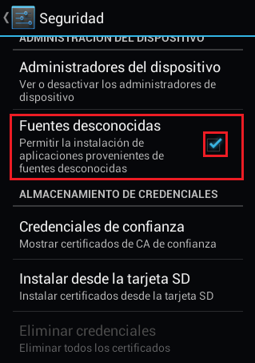
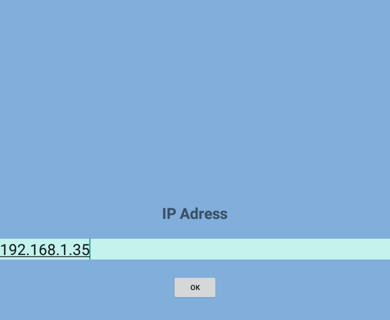

.. _InstalacionCliente:

Instalación y configuración
===========================

Para instalar **Undrive** en su celular o tablet, primero en los ajustes de su celular o tablet, marque la opcion fuentes desconocidas, para permitir instalar aplicaciones externas en su celular o tablet:

Copie el archivo apk de instalacion, ubicado en la carpeta cliente/APK, en su celular.

Finalmente abra el archivo en su celular e indique instalarlo.

Luego de este ultimo paso, ya debe tener disponible la aplicación en su celular o tablet.

Como ultimo paso debe abrir la aplicación y en la opción de configuración, copiar la ip del servidor:

|
|
| :ref:`Volver a la pagina anterior <ManCliente>`
| :ref:`Volver a la pagina principal <index>`

